# Performance-Optimization
Steepest Descent and Newton's Method

If we have a function f(x) and its derivative df(x), we can find the minimum of f(x) by using the following methods:

$$
\Rightarrow F_{(x)} = 2x_1^2 + 9x_1x_2 + 6x_2^2 + 8x_1 + 3x_2
$$

$$
\nabla F_{(x)}=\begin{bmatrix} 
	\dfrac{\partial } {\partial x_1}  F_{(x)} \\
	\\
	\dfrac{\partial } {\partial x_2}  F_{(x)} \\
	\end{bmatrix}
	=\begin{bmatrix} 
	4x_1 + 9x_2 + 8 \\
	\\
	12x_2 + 9x_1 + 3 \\
	\end{bmatrix}
$$

$$
A = \nabla^2 F_{(x)}=\begin{bmatrix} 
	\dfrac{\partial } {\partial x_1^2} F_{(x)} & \dfrac{\partial } {\partial x_1x_2} F_{(x)}\\ 
	\\
	\dfrac{\partial } {\partial x_2x_1} F_{(x)} & \dfrac{\partial } {\partial x_2^2} F_{(x)}\\
	\end{bmatrix}
	=\begin{bmatrix} 
	4 & 9\\ 
	\\
	9 & 12\\
	\end{bmatrix}
$$

So the eigenvalues of A are:
$$
\lambda \approx \begin{bmatrix} 
    -1.85 & 17.85
    \end{bmatrix}
$$
$$
v\approx \begin{bmatrix} 
    -0.84 & -0.54\\
    0.54 & -0.84
    \end{bmatrix}
$$
$$
\lambda_1\lambda_2 <0
$$

$\Rightarrow$ We have Saddle-point

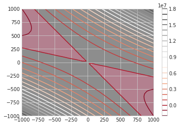

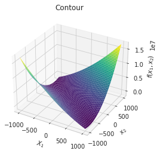

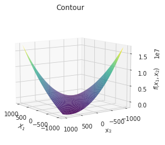

## Steepest Descent Method

$$
{x_{k+1}} = x_k - \alpha \nabla F_{(x_k)}
$$

$$
x_0 = \begin{bmatrix} 
    -0.1 e \\
    +0.1 e \\
    \end{bmatrix}
$$

$$
\Rightarrow x_0 = \begin{bmatrix} 
    -0.3 \\
    +0.3 \\
    \end{bmatrix}
$$

#### Minimize Along the Line
$$
\alpha_k = \frac{\nabla F_{(x_k)}^T \nabla F_{(x_k)}}{\nabla F_{(x_k)}^T A \nabla F_{(x_k)}}
$$

---
#### Steepest Descent Optimization with eps $10^{-5}$ and max_iter 2
---

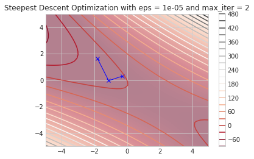
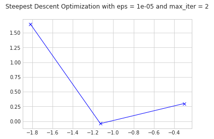
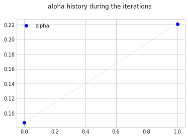
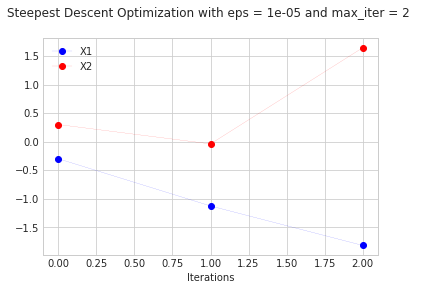

---
#### Steepest Descent Optimization with eps $10^{-18}$ and max_iter 1000
---
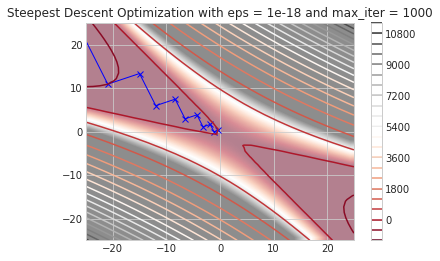
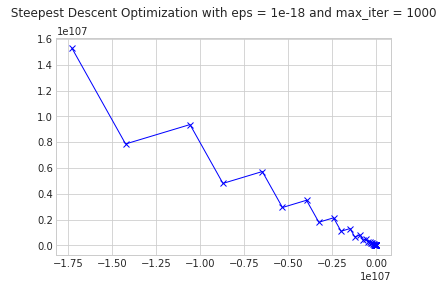
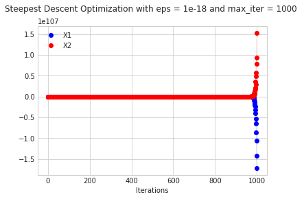
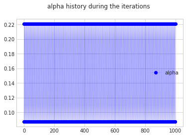

# Newton's Method

$$
x_{k+1} = x_k - A_k^{-1} \nabla F_{(x_k)}
$$

$$
A_k = \nabla^2 F_{(x_k)} = \begin{bmatrix} 
    \dfrac{\partial } {\partial x_1^2} F_{(x_k)} & \dfrac{\partial } {\partial x_1x_2} F_{(x_k)}\\ 
    \\
    \dfrac{\partial } {\partial x_2x_1} F_{(x_k)} & \dfrac{\partial } {\partial x_2^2} F_{(x_k)}\\
    \end{bmatrix}
    =\begin{bmatrix}
    4 & 9\\
    \\
    9 & 12\\
    \end{bmatrix}
$$

$$
x_0 = \begin{bmatrix} 
    -0.1 e \\
    +0.1 e \\
    \end{bmatrix}
$$

$$
\Rightarrow x_0 = \begin{bmatrix} 
    -0.3 \\
    +0.3 \\
    \end{bmatrix}
$$
---
#### Newton's Optimization with eps $10^{-5}$ and max_iter 2
---
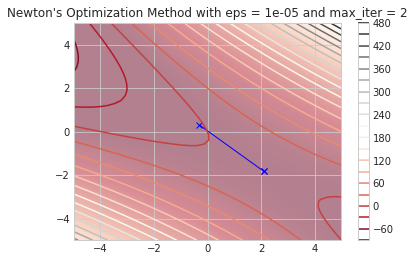
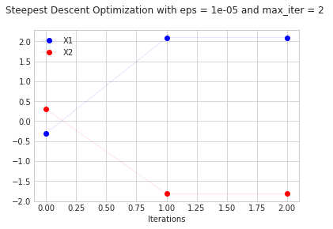

---
#### Newton's Optimization with eps $10^{-18}$ and max_iter 1000
---
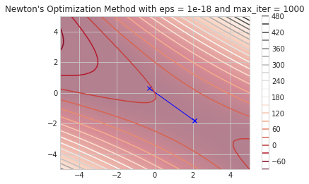
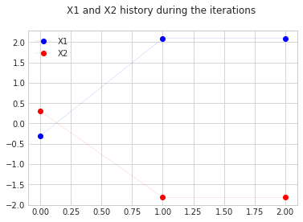

## Thereupon:
By setting up the accuracy (epsilon) to be $eps=10^{-5}$ and the maximum number of iterations to be $2$, we can get the following result:
As we can see, the steepest descent method converges to the minimum of the function in the third iteration, and Newton's method converges to the minimum of the function in the second iteration.

Additionally, we decrease the accuracy(epsilon) to $10^{-18}$ and increase the maximum number of iterations to $10^{3}$ in the steepest descent method and $10^{3}$ in Newton's method, respectively, we can get the following result:
As we can see, the steepest descent method converges to the minimum of the function more than ten times, and Newton's method converges to the minimum of the function in the second iteration.

So, according to the above results, we can conclude that the newton's method is more accurate and faster than the steepest descent method.
The steepest descent method is not suitable for solving the nonlinear equations, and newton's method is ideal for solving the nonlinear equations.
